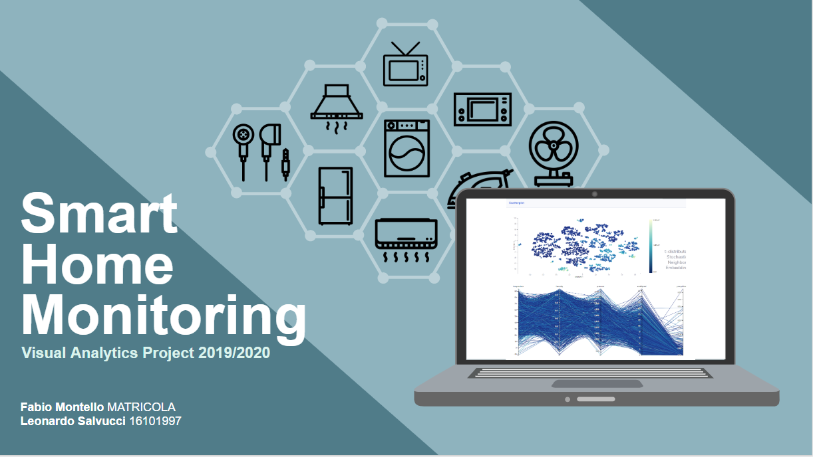

# Visual Analytics - Smart home monitoring
This repository contains the code and all the references for our Visual Analytics project.

### Overview
Our project aims to help a common user in viewing and analyzing data related to their smart home. It contains time readings on different appliances in a house, combined with data on weather conditions. We will illustrate the graphs and techniques used to extract visual information from the data set, discussing the purpose of the methods we used and the choices we made.

### Technologies involved in the project
* [Python](https://www.st.com/en/evaluation-tools/b-l072z-lrwan1.html) 
* [Pandas](https://pandas.pydata.org/) 
* [Javascript](https://www.w3schools.com/js/) 
* [D3.js](https://d3js.org/) 
* [Bootstrap](https://getbootstrap.com/) 

# Demo

### Team
* [Fabio Montello](https://www.linkedin.com/in/fabiomontello/) 
* [Leonardo Salvucci](https://www.linkedin.com/in/leonardo-salvucci/)  

### Useful links
Data manipulation: https://colab.research.google.com/drive/1pByLxG7t0G9hJ9pqRmo0wPuflu1DU13D/  
Link: https://fabiomontello.github.io/va-IOT-project/  
Slide presentation: https://fabiomontello.github.io/va-IOT-project/  
Documentaion: https://fabiomontello.github.io/va-IOT-project/
