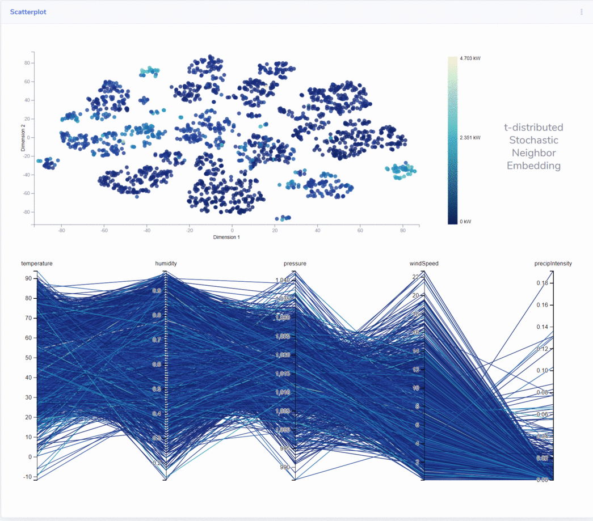

# Visual Analytics - Smart home monitoring
This repository contains the code and all the references for our Visual Analytics project.

### Overview
Our project aims to help a common user in viewing and analyzing data related to their smart home. It contains time readings on different appliances in a house, combined with data on weather conditions. We will illustrate the graphs and techniques used to extract visual information from the data set, discussing the purpose of the methods we used and the choices we made.

### Technologies involved in the project
* [Python](https://www.st.com/en/evaluation-tools/b-l072z-lrwan1.html) 
* [Pandas](https://pandas.pydata.org/) 
* [Javascript](https://www.w3schools.com/js/) 
* [D3.js](https://d3js.org/) 
* [Bootstrap](https://getbootstrap.com/) 

### Visualizations and functionalities
# Area chart 
The first chart that the user encounters in the homepage of our dashboard is the area chart. In this chart, we visualize the total consumption of the last 7 days in the house with an area chart. On the x axis we have a temporal scale, meanwhile on the y axis we have the consumption (in kW). On top of the areachart we added a line chart, displaying the trend of the energy generation. The idea of having a line chart instead of the area chart for the energy generation is because we want to consider the generation completely independent from the consumption. We thought that a stacked or negative area chart could be confusing for the final user or could be displaying wrong informations. On the right side, we have the legend, displaying which colors correspond to which feature. On the bottom part of the visualization, we have another chart, in black, displaying again the total energy consumption of the week. The x axis displays the days of the week. On top of this small chart, we have a bush tool, which will enable us to select a part of the area. By interacting on the small chart, we will have a result in interaction on the main chart, on top: brushing a part of the small area on the bottom will result in a zoomed visualization of the selected area on the top graph. With this interaction, we want to enable the user to be able to pass from a weekly overview of the data to an in-depth daily or hourly base view, where he can clearly focus on the visual anomalies, as first attempt to identify not ordinary energy consumptions (or generations). Furthermore, it is possible for the user to retrieve the exact values of generated  and consumpted electricity by having the mouse over the hour position he/she is interested in. A vertical bar will appear, helping the user understand exactly where he/she is pointing, and the value of the energy at that point will appear on the right side, before the legend.
From this chart, by toggling on the right side of the chart container, it is possible for the user to see the total consumption area chart as a stacked area chart of the consumption of each device in the house. Each device will have a different colored area, so for the user will be easier to identify which device generated some outlier. This chart has the same tooltip interaction as before, to see the consumption of energy of each single device. It has also, as before, the option of zooming and panning by selecting the small chart on the bottom, which remains the same. Furthermore, it implements the possibility to add and remove single devices by clicking on the color legend. In this way, the user can exclude the devices he/she is not interested, making the view space clearer. We also removed the generation line, in order to keep the view space clearer, assuming that since the user toggled the view of the consumption energy by device, he is not really interested in the generating energy.

# Correlation matrix
The second plot in the index page is a correlation matrix. The correlation between each pair of features is represented by a colour, which legend is on the top of the chart. A blue cell represents a direct correlation, a white cell expresses no correlation and a green cell represents an inverse correlation between the columns. Since for the human eye is easy to identify the pattern by colours, but difficult to estimate the actual number just from it, we added an interaction, where the user can go with the mouse over an interested cell, and instead of the colour, the actual correlation value will be displayed. This lets once again the user to have a general overview and after to go in-depth on the parts of the charts he is most interested about.
#
#
#
#
#

### Demo

### Team
* [Fabio Montello](https://www.linkedin.com/in/fabiomontello/) 
* [Leonardo Salvucci](https://www.linkedin.com/in/leonardo-salvucci/)  

### Useful links
Data manipulation: https://colab.research.google.com/drive/1pByLxG7t0G9hJ9pqRmo0wPuflu1DU13D/  
Link: https://fabiomontello.github.io/va-IOT-project/  
Slide presentation: https://fabiomontello.github.io/va-IOT-project/  
Documentaion: https://fabiomontello.github.io/va-IOT-project/
